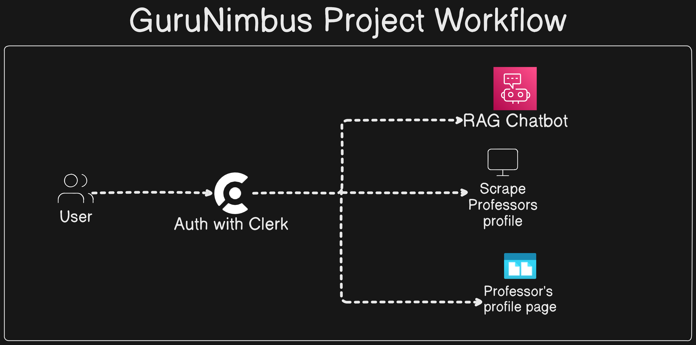

**"GuruNimbus: RAG-Powered AI Assistant"** is a web app that uses Next.js, OpenAI, and Pinecone to deliver personalized professor and mentor insights. It goes beyond conventional rating systems by leveraging AI to offer detailed evaluations, helping students make informed decisions about their courses and instructors.

## Features

1. **Rate My Professor Support Agent with RAG-Powered AI Capabilities**

2. **Web Scraping Integration**

3. **Advanced Search option to find Professors**


## Tech Stack
- NextJs
- Typescript
- Jupyter Notebook
- Python
- Pinecone
- OpenAI

## For APIs
- Openrouter API Key
- Gemini API Key

## DevOps Practices
- CI/CD with GitHub Actions
- Dockerization 

## Project Workflow



### Installation for local development:
1. Download [**Miniconda**](https://docs.anaconda.com/miniconda/) of your system.

2. [fork the reqpository](https://github.com/Suraj-kumar00/GuruNimbus/fork)


```bash
# Install Next.js package dependencies
npm install

# Create a new Conda environment named 'rag' with Python 3.10.4
conda create --name rag python=3.10.4

# Activate the 'rag' environment
conda activate rag

# To install all package/dependencies in one signle commands:
pip install -r requirements.txt

# Install the python-dotenv package for managing environment variables
pip install python-dotenv

# Install the Pinecone client library with gRPC support
pip install "pinecone-client[grpc]"

# Deactivate the current Conda environment if you want
conda deactivate

```

---
### Setting up .env secrets:
```bash
# After coping add your API keys
cp .env.example .env
```

### Run the project:
```bash
npm run dev
```

## Running the project using Docker
First Install [**Docker Desktop**](https://www.docker.com/products/docker-desktop/)

**Pull the image**
```bash
docker pull surajkumar00/gurunimbus 
```
**Run the Container**
```bash
docker run -it -p 3000:3000 surajkumar00/gurunimbus
```
On your browser check: [localhost:3000](localhost:3000)


## Welcome Contributros!
Want to contribute? Great!

[**Read the Contribution Guidlines**](https://github.com/Suraj-kumar00/GuruNimbus/blob/main/CONTRIBUTING.md)

## License

[Apache-2.0 license](https://github.com/Suraj-kumar00/GuruNimbus/blob/main/LICENSE)


## Support via giving a ⭐ star 